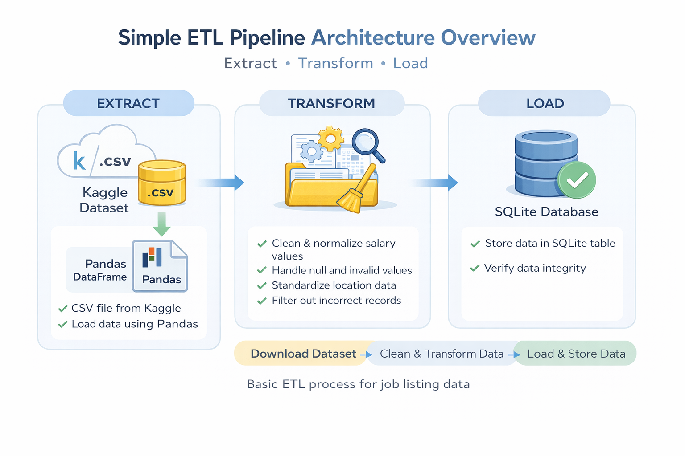
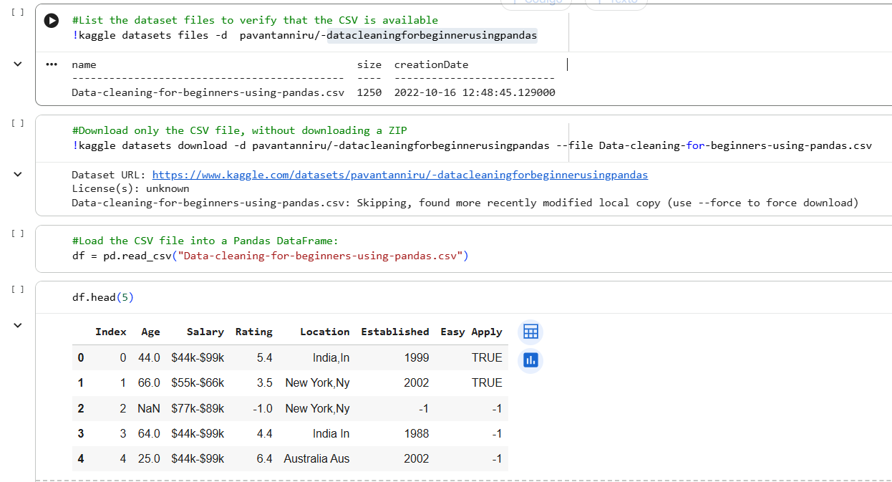
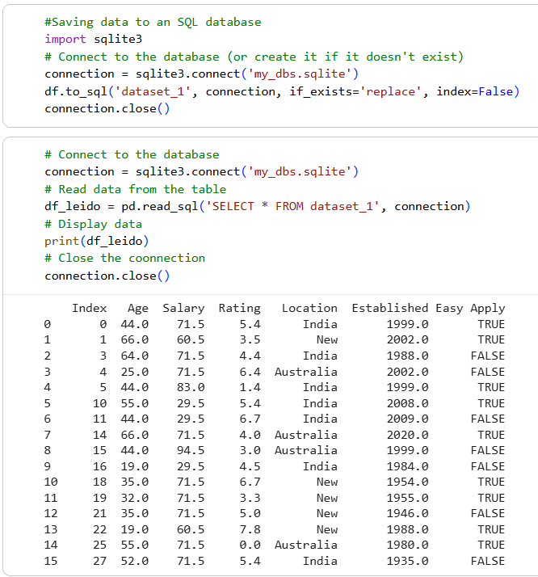
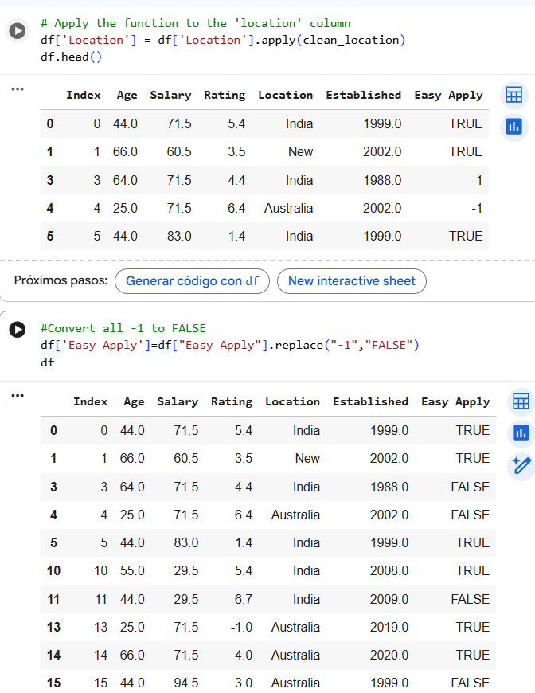

# Simple ETL Pipeline: Extraction, Transformation, and Loading

## 📌 Project Overview

This project implements a simple **ETL (Extract, Transform, Load) pipeline** using Python and Pandas.  
The pipeline extracts a public dataset from Kaggle, performs data cleaning and transformation steps, and loads the processed data into a local SQL database.

The main objective of this project is to demonstrate foundational data engineering skills, including data ingestion, transformation logic, and data persistence.

---

## 🏗️ Project Architecture

**Extract**
- Download dataset programmatically using the Kaggle API
- Load CSV data into a Pandas DataFrame

**Transform**
- Handle missing and invalid values
- Clean and standardize salary data
- Convert salary ranges into numeric averages
- Normalize location values
- Filter out invalid records

**Load**
- Store the cleaned dataset into a SQLite database
- Validate the load by querying the database

---
## 📐 Architecture Overview

---

## 🛠️ Technologies Used

- Python  
- Pandas  
- NumPy  
- Kaggle API  
- SQLite  
- Google Colab  

---

## 📂 Dataset

- Source: Kaggle public dataset  
- Format: CSV  
- Domain: Job listings and salary information 
- Source: https://www.kaggle.com/datasets/pavantanniru/-datacleaningforbeginnerusingpandas/data

The dataset is downloaded directly within the pipeline to simulate a real data extraction process.

---

## 🔄 Data Transformation Steps

The following transformations are applied to the dataset:

- Replace invalid placeholder values (`-1`) with nulls
- Remove rows containing null values
- Clean salary strings by removing symbols such as `$` and `k`
- Convert salary ranges into numeric average values
- Normalize location data
- Remove records with invalid ratings
- Standardize boolean-like fields

These steps ensure the data is clean and ready for analysis.

---

## 💾 Data Loading

- The transformed data is loaded into a local **SQLite** database
- Table name: `dataset_1`
- Data integrity is verified by reading the data back from the database

---

## 🔍 Pipeline Walkthrough (Evidence)

### Extraction Evidence 

### Transformation Evidence

### Loading Evidence

---

## 🚀 How to Run the Project

1. Open the notebook in **Google Colab**
2. Upload your `kaggle.json` credentials when prompted
3. Run all cells in order
4. The dataset will be downloaded, cleaned, and stored automatically

---

## 🎯 Why This Project Matters

- A basic understanding of ETL data pipeline design  
- Practical experience cleaning and transforming real-world datasets  
- Use of reusable Python functions for data processing  
- Integration between Python and SQL databases  
- Clear separation between extraction, transformation, and loading steps  

---

## 📌 Notes

This project is intended for learning and portfolio purposes.  
It focuses on clarity, correctness, and good data engineering practices rather than advanced optimizations.

---

## 🧑‍💻 Author

**Ricardo Martinez**

Data Engineer | SQL | ELT | Python